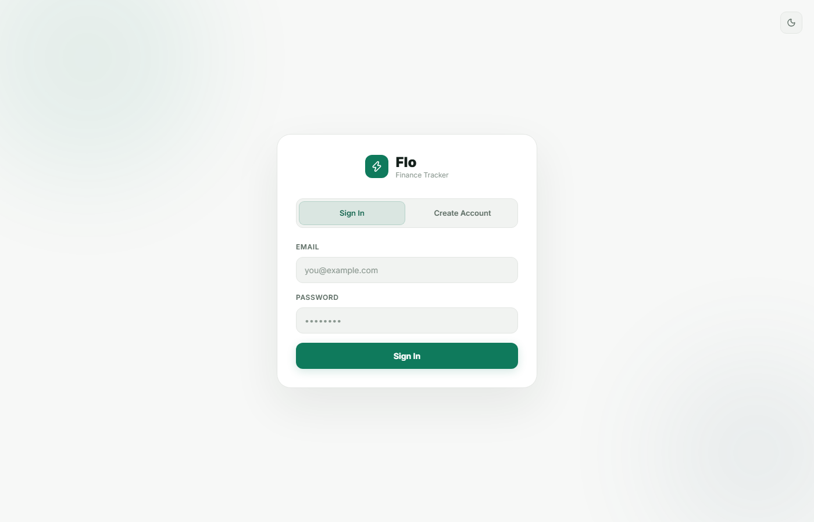
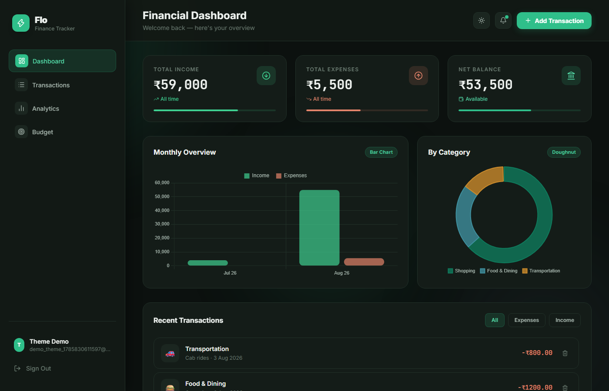
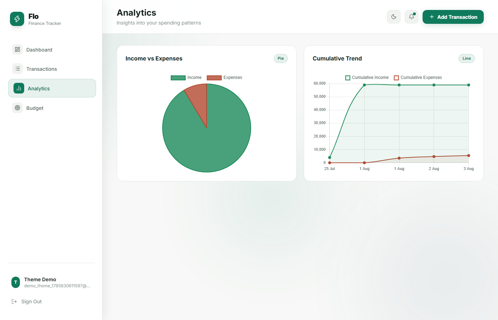

# Flo — Finance Tracker 💸

A full-stack personal finance tracker built with vanilla JavaScript, PHP, and MySQL. Track income and expenses, visualize spending by category, set monthly budgets, and see trends over time.

## Features
- 🔐 User authentication (register/login) with session-based auth
- 💰 Track income & expenses by category
- 📊 Analytics with charts (monthly trends, category breakdown, cumulative income vs. expenses)
- 📅 Budget management per category per month
- 🔍 Search & filter transactions
- 🌗 Light & dark mode, saved per device

## Tech Stack
- **Frontend:** HTML, CSS, Vanilla JavaScript, Chart.js, Tailwind CSS
- **Backend:** PHP (session-based auth, REST-style JSON endpoints)
- **Database:** MySQL

## Screenshots

| Login | Dashboard |
|---|---|
|  |  |

**Analytics**


## Setup (Local)

1. Clone the repo into your XAMPP `htdocs` folder
2. Start Apache & MySQL in XAMPP Control Panel
3. Copy `config/db.example.php` to `config/db.php` and fill in your credentials
4. Import `config/setup.sql` in phpMyAdmin to create the database & tables
5. Open `http://localhost/expense-tracker/login.html`

## Project Structure

```
├── index.html          # Dashboard (transactions, analytics, budgets)
├── login.html           # Sign in / create account
├── script.js             # Frontend logic + API calls
├── style.css             # Styling
├── api/
│   ├── auth/              # register, login, logout, session check
│   ├── transactions/    # add, get, delete
│   ├── analytics/        # monthly trends, summary
│   └── budget/            # get, save
└── config/
    ├── db.example.php  # DB credentials template
    ├── auth.php           # session helper + CORS
    └── setup.sql          # database schema
```

## Author
Built by [Mayank Dobhal](https://github.com/Mayank9897)

## License
[MIT](LICENSE) © 2026 Mayank Dobhal
